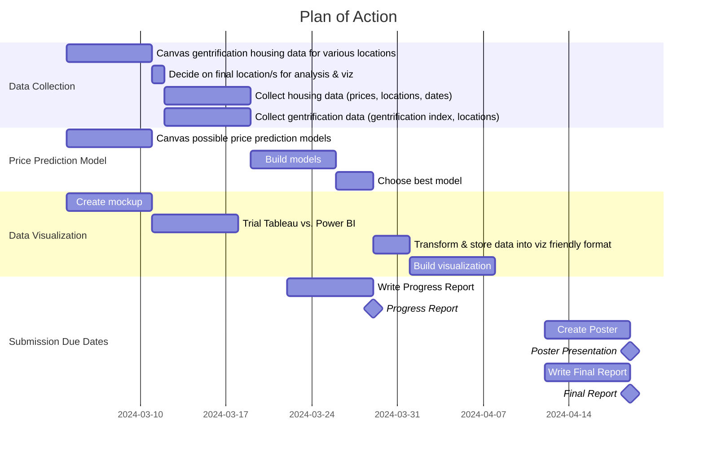

```mermaid
gantt
    title Plan of Action
    dateFormat YYYY-MM-DD

    section Data Collection
    Canvas gentrification housing data for various locations  : collect1, 2024-03-04, 7d
    Decide on final location/s for analysis & viz    :   collect2, after collect1, 1d
    Collect housing data (prices, locations, dates)  :    collect3, after collect2, 7d
    Collect gentrification data (gentrification index, locations) :   collect4, after collect2, 7d

    section Price Prediction Model
    Canvas possible price prediction models  :   predict1, 2024-03-04, 7d
    Build models    :   predict2, after collect4, 7d
    Choose best model   :   predict3, after predict2, 3d

    section Data Visualization
    Create mockup  :   viz1, 2024-03-04, 7d
    Trial Tableau vs. Power BI  :   viz2, after viz1, 7d
    Transform & store data into viz friendly format   :   viz3, after predict3, 3d
    Build visualization :   viz4, after viz3, 7d

    section Submission Due Dates
    Write Progress Report   :   submit1, 2024-03-22, 7d
    Progress Report :   milestone, 2024-03-29
    Create Poster   :   submit2, 2024-04-12, 7d
    Poster Presentation :   milestone, 2024-04-19
    Write Final Report   :   submit3, 2024-04-12, 7d
    Final Report :   milestone, 2024-04-19
```